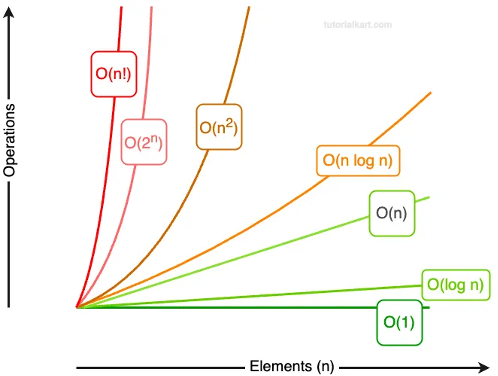
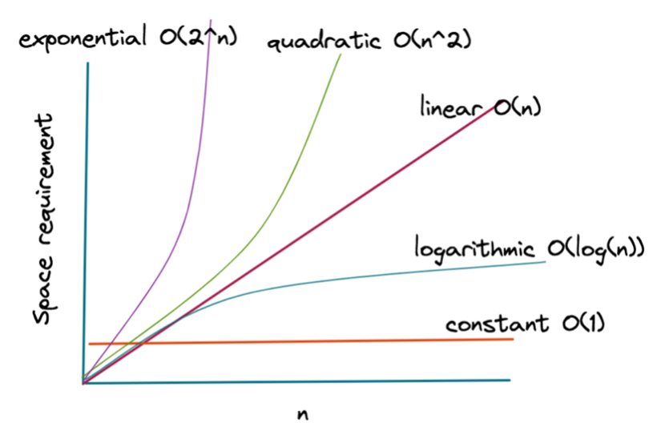

# Research on Map Interface (TreeMap, HashMap, LinkedHashMap)

## Problem analysis

In this study I want to analyze a problem within the elections project and find a solution to that problem using an algorithm that I wrote using my assigned topic which is the Map interface. First, I am going to discuss the problem using the 6 Ws, then I will explain everything around the topic and finally I will show and demonstrate my algorithm. 

**1. What is the cause?**

The cause of this problem is our elections project. Within this project we have found some possible problems that we need to solve. One of those problems is the sorting of candidates by province. In this study I will analyze and solve this problem using my assigned topic which is the Map interface.

**2. What is the problem/need?**

The main problem is that the raw candidate data is unsorted. One of the requirements for the website is that we need to display the candidates sorted by province. 
What we need is an algorithm that processes all the candidates and sorts them by province while being as fast and efficient as possible.

**3. Who has the problem/need?**

Our users need a clear and sorted list of the candidates per province for the best user experience. 

**4. When did the problem/need arise?**

The problem arose when we saw that the data of the candidates from the XML files is unsorted. 

**5. Why is it a problem/need?**

This is a problem because we need to display the candidates as clear as possible to ensure the best user experience. Therefore, this is a problem that needs to be solved. 

**6. Where does the problem/need occur?**

This problem occurs in the back-end of our website where we parse the XML data to display it in the front-end. That is the place where I need to write an algorithm to sort all the data before displaying it in the front-end.

## Research questions

Based on the problem analysis, I have formulated a main research question and three sub-questions to guide this study. 

### Main research Question

“How can the Java Map interface be used to efficiently sort election candidates by province, and which implementation offers the best performance?”

### Sub-questions

1. What are the characteristics of the Java Map interface and the key differences between the HashMap, TreeMap and LinkedHashMap?
2. What is the time and space complexity of these data structures, and how does this impact their performance?
3. How can an algorithm be designed and optimized to efficiently sort election candidates by province using the Map interface?

## The Map Interface

In Java the Map interface is a well-known interface that is part of the java.util package and is widely used by programmers every day. Since Map is an interface, objects cannot be created of the type Map. Instead, we always need a class that implements this interface in order to create an object (Oracle, n.d.-b). The three primary classes that implement this interface are:
- HashMap
- TreeMap
- LinkedHashMap

There are of course more classes that implement the Map interface, but they are not widely used and some are outdated. 

In essence these three classes all follow the same Map interface. Each of these maps contains a key and a value which are stored in these maps, and they do not allow duplicate keys. The difference lies more in how they are stored in the maps and how fast they can be retrieved from the maps. This is an example of one key-value pair.

(Key: “Zuid-Holland”, value: “Mark Rutte”)

The Map interface also has methods defined which you can use. Some of the methods include: 

- Put (This allows you to insert a key-value pair in the map)
- Get (Returns the value for the given key, returns null if not found)
- Remove (Removes the key-value pair for the given key)
- containsKey (Checks if a key exists in the map)
- containsValue (Checks if a value exists in the map)
- size (Returns the number of key-value pairs in the map)
- isEmpty (Returns true if the map is empty)
- keyset (Returns all the keys in a map)
(Oracle, n.d.-b).

### Comparison between HashMap, TreeMap and LinkedHashMap

So now that we know that we have 3 classes that implement the Map interface, what is the difference between these classes? 

The biggest difference lies in how these maps store the key-value pairs. Let’s compare these three.

- **HashMap:**

A HashMap uses a hash function to convert a key into a unique and consistent number (hash code) to store the key in a specific place. When it is asked to find a key, it will recalculate the hash code to find the correct place where it is stored. It is also possible for multiple keys to be stored in the same exact place; this is called hash collision. If that happens the system will do one extra check to find the right key. This approach of storing keys is way faster than a TreeMap for example, which we will talk later about. The HashMap does have one disadvantage and that is that it doesn’t guarantee any structured order in the keys, this means that it can give the keys in a different order each time (Oracle, n.d.-b). A HashMap also has a set number of buckets which it can store the data in. When reaching the limit of these buckets, it will need to resize the buckets to fit more data, costing more time. That’s why it can be important to tell the HashMap how many buckets it needs to make before storing all the data (Oracle, n.d.-b). 

- **LinkedHashMap:**

A LinkedHashMap works exactly the same as a standard HashMap except for one key difference. The LinkedHashMap remembers the order in which you give the keys (Oracle, n.d.-b). It basically does everything the same as the standard HashMap but with an extra step and that is to remember the order in which you gave the keys. 

- **TreeMap:**

A TreeMap works very different from the HashMap. It doesn’t have a special function to hash the keys, instead it stores the keys in natural order (Oracle, n.d.-b). Natural order could mean that it stores the keys in alphabetical order, numerical order or chronological order. Because of this order it can use binary search to find a certain key. Binary search means it will start searching in the middle, it will then determine if your key is smaller or bigger than the middle key. If its smaller, it will look to the left and if its bigger, it will look to the right. It will repeat this process until it has found the right key. 

Using this approach makes the TreeMap offer slower performance than a HashMap because it needs to go through more questions to find one specific key. Whereas a HashMap instantly knows where the key is stored because of the hash code. 

### Time complexity (Big O notation)

 **Figure 1** *Time Complexity Chart* Note. From *Time complexity 1* , by Tutorial Kart, 2024, Tutorial Kart (https://www.tutorialkart.com/wp-content/uploads/2024/12/time-complexity-1.webp).

Because of the different approaches to storing the keys, these maps have a different time complexity. With time complexity we can measure how fast an algorithm really is. This graph visualizes the different notations. The input size represents the amount of data the algorithm has to process, and the time shows how many steps it has to do before being finished. The fastest algorithm is O (1) which means that no matter the amount data it will always perform as fast. O (n!) means that the algorithm will perform much slower when it has to handle more data. In our case, the HashMap and LinkedHashMap have a time complexity of O (1) which is the fastest. The TreeMap has a time complexity of O (log n). This means that the TreeMap is a little bit slower than the HashMap and LinkedHashMap. When I am finished with my algorithm, I will calculate the time complexity to see how fast it performs.  

### Space complexity (Big O notation)

 **Figure 2** *Space Complexity Visualization* Note. From *Understanding Space Complexity*, by AlgoDaily, n.d., AlgoDaily (https://algodaily.com/lessons/understanding-space-complexity).

Space complexity is the same as time complexity but instead of the time we are measuring how much memory is used for an algorithm. It uses the same Big O notation as time complexity. HashMap, TreeMap and LinkedHashMap generally have a complexity of O(n), where n is the number of key-value pairs stored. This means that the memory usage grows linearly with the amount of data.  

### Conclusion:

Now that we know how each of these maps work, which is the best one? There is not really a best one, because each of these maps will be used depending on the situation. In our case we will be using the TreeMap to store the candidates while also sorting the list based on province. Even though the HashMap is faster, we cannot only use a HashMap, because it doesn’t sort the list in any way, which is our only problem. Therefore, we have to combine HashMap and TreeMap if we want to use HashMap. In this image you will once again see pros and cons of each map to compare them. 

**Figure 3** *Comparison of Map Implementations* Note. From *Java Maps - HashMap, LinkedHashMap, TreeMap, Hashtable* [Video] (07:00), by Paul Programming, 2018, YouTube (https://www.youtube.com/watch?v=Wc8u3OuDVFg).

## Algorithm implementation and analysis

After analyzing the problem and researching everything about the Map interface, I wrote an algorithm to order the candidates by province. I decided to write the algorithm in a standalone project for now and I will integrate it later into the elections project. 

### Base algorithm:

I started by creating a candidate class that has the variables “name” and “province”. Then I simulated a database by creating a method that returns an array list that consists of fake data.  I can choose how many candidates the method returns by giving a random value. After that I put all the data in a TreeMap. The key in this map are the provinces, and the value is a list of candidates because there can be multiple candidates per province. Then I looped through all the candidates to link the candidates to each province. If a province already exists in the map, the candidate will be added to that province. If not, then a new province will be created, and the candidate will be added to the new province. This Algorithm gives us a time complexity of O (n log k), because the for loop itself is O(n) and the TreeMap operations within the for loop are O (log k). Multiplying these gives us a time complexity of O (n log k). 

After analyzing my algorithm, I realized that I could make a faster algorithm that is more efficient, because the TreeMap performs a relatively expensive sorting operation
 (O (log k)) for every single candidate we add. Since we have a large number of candidates, repeating this step thousands of times is not efficient. It is much faster to group all the data with a HashMap first and sort the provinces only once with a TreeMap at the end. 

### Optimized algorithm:

With my analysis in mind, I wrote a new algorithm that is more efficient. I started by putting all the candidates in a HashMap. All that was left to do was put everything in a TreeMap to sort every candidate by province and now I have a much faster algorithm because I let the HashMap do all the hard work (grouping) and I let the TreeMap do the sorting.  After running some tests, I found out that this algorithm is about twice as fast as my previous algorithm. 

## Sources:

GeeksforGeeks. (n.d.). Map Interface in Java. Retrieved November 14, 2025, from https://www.geeksforgeeks.org/java-map-interface-in-java/
Oracle. (n.d.-a). Class HashMap<K,V>. Java Platform, Standard Edition 8 API Specification. Retrieved November 14, 2025, from https://docs.oracle.com/javase/8/docs/api/java/util/HashMap.html
Oracle. (n.d.-b). The Map Interface. The Java™ Tutorials. Retrieved November 14, 2025, from https://docs.oracle.com/javase/tutorial/collections/interfaces/map.html
Paul Programming. (2018, November 2). Java Maps - HashMap, LinkedHashMap, TreeMap, Hashtable [Video]. YouTube. https://www.youtube.com/watch?v=Wc8u3OuDVFg
Slidenerd. (2014, October 28). Data Structures: Hash Tables [Video]. YouTube. https://www.youtube.com/watch?v=XMUe3zFhM5c
freeCodeCamp. (2024, 25 january). What is a Hash Map? Time Complexity and Two Sum Example. https://www.freecodecamp.org/news/what-is-a-hash-map/
Oracle. (n.d.-c). Class TreeMap<K,V>. Java Platform, Standard Edition 8 API Specification. Retrieved November 18, 2025, from https://docs.oracle.com/javase/8/docs/api/java/util/TreeMap.html