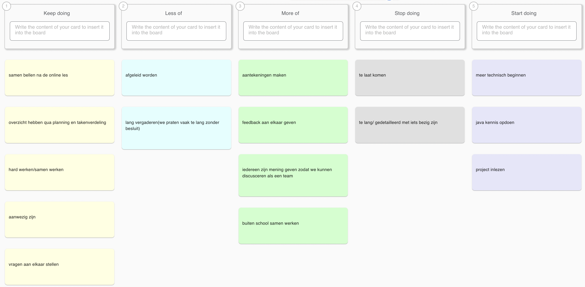

# Retrospective sprint 1

## Uitkomst retrospective

## Aandeel teamleden
N.V.T.

## Feedback voor teamleden

## Milad
**Tops:**
- je werkt hard en denkt mee, dat motiveert mij om ook hard te werken aan het project. (Melvin)  
- Ik vind dat je heel goed de planning bijhoud en iedereen op de hoogte houdt van alle dingen die gebeuren omtrent het project. (Sekander)  
- Ik merk dat je goed georganiseerd bent en leiderschapskwaliteiten laat zien. (Simon)  
- ik merk dat je vaak het inatiatief neemt, het effect op mij is dat ik sneller kan schakelen omdat jij de eerste stap zet. (Timi)  

**Tips:**
- je bent een keer te laat gekomen, probeer het op 0 te houden (Melvin)  
- Misschien kun je soms wat serieuzer zijn. (Sekander)  
- Ik merk dat het beter zou zijn als je op belangrijke momenten niet te laat komt. (Simon)  
- ik merk dat je soms te laat komt, het effect op mij is dat ik later kan beginnen met bepaalde teamactiviteiten, waardoor ik me opgehouden voel. (Timi)  

---

## Simon
**Tops:**
- je wilt veel samen werken buiten de les, dat motiveert mij ook om samen aan de opdracht te werken. (Melvin)  
- Ik vind dat je heel erg goed de sfeer goed en professioneel houdt. (Sekander)  
- Ik merk dat je serieus bezig bent met dit project en dat je alles op tijd af wilt, dit motiveert mij ook om harder te werken, ik zou je adviseren om zo door te gaan. (Milad)  
- ik merk dat je hard werkt en goed communiceert. (Timi)  

**Tips:**
- probeer meer je mening te geven (Melvin)  
- Ik vind dat je soms wat actiever online kan zijn. (Sekander)  
- Ik merk dat je soms laat reageert op onze berichten dit zorgt ervoor dat ik niet weet waar je mee bezig bent, ik zou je adviseren om sneller te reageren. (Milad)  
- Ik merk dat je soms teveel stresst,  het effect op mij is dat ik minder goed kan focussen op mijn taken. (Timi)  

---

## Sekander
**Tops:**
- Je presenteert goed en duidelijk, dit motiveert mij om beter te presenteren. (Melvin)  
- Ik merk dat je alles doet wat er gevraagd wordt van je en dat je op tijd klaar bent dit motiveert mij ook om harder te werken en ik zou je adviseren om zo door te gaan. (Milad)  
- Ik merk dat je heel goed communiceert en voor een prettige werksfeer binnen het team zorgt. (Simon)  
- Ik merk dat je je taken op tijd af hebt, dat ik vertrouwen krijg dat het project goed verloopt. (Timi)  

**Tips:**
- Soms kun je wat geconcentreerder werken aan de opdracht. (Melvin)  
- Ik merk dat je tijdens de les snel afgeleid raakt, dit zorgt ervoor dat ik ook afgeleid raak, ik zou je adviseren om wat meer locked in te zijn. (Milad)  
- Ik merk dat je nog sterker zou overkomen als je soms iets serieuzer bent. (Simon)  
- Ik merkte dat je niet aanwezig was door het weer, het effect op mij is dat ik sommige taken alleen moest oppakken. (Timi)  

---

## Timi
**Tops:**
- je werkt hard en denkt goed mee, hierdoor zie ik andere mensen hun perspectieven. (Melvin)  
- Ik vind dat je heel precies en goed te werk gaat en goed aangeeft waar je mee bezig bent om dat moment. (Sekander)  
- Ik merk dat je dit project serieus neemt en je best doet dit motiveert mij ook om harder te werken. (Milad)  
- Ik merk dat je hard werkt en je volledig inzet voor het team. (Simon)  

**Tips:**
- Soms meer je mening geven (Melvin)  
- Ik heb het gevoel dat je soms wat meer je mening mag geven in groepssituaties. (Sekander)  
- Ik merk dat je soms wat later de call joint en dit zorgt ervoor dat we op jou moeten wachten ik zou je adviseren om op tijd de call te joinen. (Milad)  
- Ik merk dat je meer energie zou kunnen tonen, omdat je er vaak erg moe uitziet. (Simon)  

---

## Melvin
**Tops:**
- Ik merk dat je buiten de les om hard aan het werk aan ons project en dit motiveert mij ook om hard te werken, ik zou je adviseren om zo door te gaan. (Milad)  
- Ik vind dat je echt het voortouw hebt gepakt kwa design in figma. Dat vind ik erg fijn. (Sekander)  
- Ik merk dat je een duidelijke planning hebt en heel georganiseerd werkt. (Simon)  
- ik merk dat je goed bent in ui, het effect op mij is dat ik minder zorgen heb over dit onderdeel en me kan focussen op andere taken. (Timi)  

**Tips:**
- Ik merk dat je soms tijdens de les afgeleid raakt en dat zorgt ervoor dat ik ook afgeleid raak, ik zou je adviseren om meer locked in te zijn. (Milad)  
- Soms kun je wat serieuzer zijn binnen de groep. (Sekander)  
- Ik merk dat je in sommige situaties professioneler kan overkomen door meer serieusheid te tonen. (Simon)  
- Ik merk dat je soms minder serieus bent het effect op mij is dat ik moeite heb om me te concentreren. (Timi)  

##### Eigen reflectie

## SMART leerdoel Melvin

---

SMART-doel Sprint 2 

Specifiek: In de lessen van Sprint 2 ga ik serieuzer werken door goed op te letten en bezig te blijven met de opdrachten, zonder afleiding. 

Meetbaar: In minstens 8 van de 10 lessen kan ik laten zien dat ik echt voortgang heb gemaakt aan de opdracht. 

Acceptabel: Dit helpt mij om meer te leren én mijn team vooruit te helpen. 

Realistisch: Het is haalbaar, omdat ik alleen mezelf serieuzer hoef in te zetten. 

Tijdgebonden: Dit doel geldt alleen voor Sprint 2 en ik kijk aan het eind terug of ik dit gehaald heb. 

“In Sprint 2 let ik beter op en werk ik serieuzer in de les. In 8 van de 10 lessen kan ik laten zien wat ik heb gedaan.”

## SMART leerdoel Simon

---

SMART-doel

Specifiek: Ik wil mijn programmeervaardigheden in Java en Vue verbeteren door dagelijks nieuwe concepten en technieken te leren.

Meetbaar: Ik besteed 3 uur per dag aan het leren van Java en Vue en houd mijn voortgang bij in een logboek of notities.

Acceptabel: Dit doel sluit goed aan bij mijn studie en projectwerk in deze sprint, en helpt mij om mijn taken beter uit te voeren.

Realistisch: Met een goede planning en discipline is het haalbaar om elke dag 3 uur te reserveren voor leren.

Tijdsgebonden: Aan het einde van deze sprint (2 weken) heb ik minimaal 42 uur aan Java en Vue besteed, en kan ik de opgedane kennis aantonen door kleine werkende voorbeelden of componenten.

## SMART leerdoel Timi

---

Ik wil de komende sprint tijdens elk teamoverleg minstens één keer mijn mening delen, zodat ik actiever kan meedenken en bijdragen aan betere samenwerking.

## SMART leerdoel Milad

---

SMART leerdoel sprint 2

Specifiek: Ik wil mijn zelfreflectie verbeteren door na elke schooldag 5 minuten te nemen om op te schrijven wat goed ging en wat beter kan.

Meetbaar: Ik houd dit dagelijks bij in mijn notities.

Acceptabel: Dit helpt mij bewust te worden van mijn sterke en zwakke punten.

Realistisch: Het kost slechts 5 minuten per dag, wat haalbaar is.

Tijdsgebonden: Aan het einde van deze sprint heb ik genoeg reflecties verzameld die ik kan gebruiken in mijn leerproces.

## SMART leerdoel Sekander

---

Tijdens de komende sprint wil ik mijn focus in de les verbeteren door mijn afleidingen te beperken. Concreet betekent dit dat ik gedurende minimaal 80% van de lestijd actief en geconcentreerd blijf werken aan de opdrachten. Dit meet ik door mijn voortgang en bijdrage per lesmoment vast te leggen. Het doel is haalbaar binnen één sprint en draagt bij aan een productievere samenwerking, zodat zowel ikzelf als mijn teamleden beter gefocust blijven.
