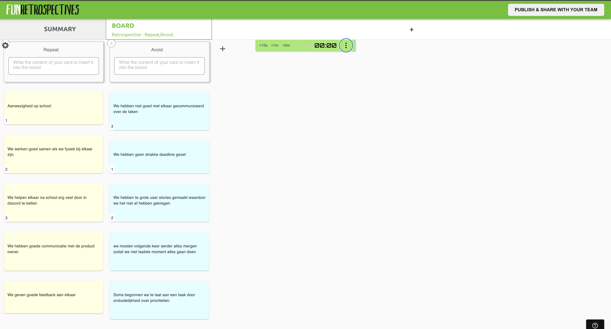

# Retrospective Sprint 2

## Uitkomst retrospective

## Aandeel teamleden

Tijdens deze sprint hadden we te grote user stories gemaakt waardoor we niet genoeg tijd hadden om per persoon 1 hele user story te maken. We hadden de user stories moeten opdelen in meerdere kleine user stories zodat we die op "done" konden zetten in de sprintboard. Omdat we dus halve user stories af hebben, hebben we ook technisch gezien geen story points af, dus daar kunnen we nu niks over zeggen. 

## Feedback voor teamleden

---

## Milad

**Tops:**

* Je hebt deze sprint nog beter overzicht gehouden in dlo/sprintbord en iedereen goed op de hoogte gehouden van deadlines. (Melvin)
* Ik vind dat je erg duidelijk communiceert wat er moet gebeuren, dat zorgt voor structuur in het team. (Sekander)
* Je bent erg betrouwbaar in je werk en zorgt ervoor dat alles op tijd af is. (Simon)
* Ik merk dat je deze sprint rustiger en professioneler bent overgekomen, dat hielp om gefocust te blijven. (Timi)

**Tips:**

* Soms kun je iets meer ruimte laten voor anderen om initiatief te nemen. (Melvin)
* Je mag soms wat relaxter zijn, je legt jezelf veel druk op. (Sekander)
* Ik merk dat je soms te veel tegelijk probeert te doen, wat kan leiden tot stressmomenten. (Simon)
* Soms mag je meer feedback vragen voordat je beslissingen neemt, dat helpt bij afstemming. (Timi)

---

## Simon

**Tops:**

* Je programmeervaardigheden zijn echt vooruitgegaan, vooral in Vue zie ik veel groei. (Melvin)
* Je bent deze sprint sneller geworden in het oplossen van bugs en deelt ook je kennis met anderen. (Sekander)
* Ik merk dat je veel meer initiatief neemt bij het coderen en goed de logica uitlegt. (Milad)
* Je hebt een positieve invloed op de groep doordat je rustig blijft als iets niet lukt. (Timi)

**Tips:**

* Soms mag je nog duidelijker communiceren wat je gedaan hebt of waar je vastloopt. (Melvin)
* Je kan proberen om iets minder perfectionistisch te zijn, zodat we sneller kunnen werken. (Sekander)
* Probeer in overleggen iets korter en concreter te zijn, zodat het tempo erin blijft. (Milad)
* Soms mag je wat meer vertrouwen op je eigen kennis en minder twijfelen. (Timi)

---

## Sekander

**Tops:**

* Je was deze sprint erg gefocust tijdens de lessen, dat hielp mij ook om geconcentreerd te blijven. (Melvin)
* Je communicatie met het team was sterk, je hield iedereen op de hoogte van je voortgang. (Milad)
* Je bent sociaal en zorgt dat het team gemotiveerd blijft, wat ik erg waardeer. (Simon)
* Je stelt goeie vragen bij onze po gesprekken wat ons als team heel erg helpt. (Timi)

**Tips:**

* Soms mag je je wat meer verdiepen in de code, zodat je nog beter begrijpt hoe alles samenwerkt. (Melvin)
* Probeer soms iets sneller te beginnen met je taken, zodat je niet in tijdnood komt. (Milad)
* Je mag iets meer actief zijn in discussies, je hebt vaak goede ideeën die je niet altijd deelt met ons. (Simon)
* Ik merk dat je soms te veel tegelijk doet, wat kan leiden tot slordigheid. (Timi)

---

## Timi

**Tops:**

* Je bent deze sprint veel actiever geweest in gesprekken, dat is leuk om te zien. (Melvin)
* Ik vind dat je goed hebt geholpen met het opzetten van de front-end structuur. (Sekander)
* Je levert altijd kwaliteit en denkt goed na over de gebruikerservaring. (Milad)
* Je bent betrouwbaar en zorgt dat je taken goed worden afgerond. (Simon)

**Tips:**

* Probeer soms iets sneller te communiceren als je ergens vastloopt. (Melvin)
* Je mag wat vaker feedback vragen zodat we samen kunnen verbeteren. (Sekander)
* Soms mag je je mening eerder geven in plaats van af te wachten. (Milad)
* Je zou iets meer durf mogen tonen in het nemen van initiatief. (Simon)

---

## Melvin

**Tops:**

* Je hebt veel vooruitgang geboekt in Vue en werkt steeds zelfstandiger. (Milad)
* Je hebt deze sprint een erg mooi en strak design neergezet, dat tilt het project visueel omhoog. (Sekander)
* Ik merk dat je veel meer focus hebt in de lessen en goed samenwerkt. (Simon)
* Je bent bereid om buiten school extra tijd te besteden aan school wat mooi is. (Timi)

**Tips:**

* Soms mag je nog wat meer documenteren wat je doet, zodat anderen het kunnen volgen. (Milad)
* Probeer iets meer rust te nemen tussen het werken door, je gaat vaak te lang door. (Sekander)
* Ik merk dat je nog iets beter kan communiceren over wat je af hebt. (Simon)
* Je mag af en toe om hulp vragen in plaats van alles zelf proberen op te lossen. (Timi)

---

##### Eigen reflectie

---

## SMART leerdoel Milad

Ik ga deze sprint verder werken aan mijn vorige smart doel. Ik heb vorige sprint niet echt kunnen focussen op mijn smart doel omdat ik erg veel tijd kwijt was aan het begrijpen van de xml parser. Daarom ga ik deze sprint er mee verder om mijn smart doel volledig af te sluiten.

**Specifiek:** Ik wil mijn zelfreflectie verbeteren door na elke schooldag 5 minuten te nemen om op te schrijven wat goed ging en wat beter kan.

**Meetbaar:** Ik houd dit dagelijks bij in mijn notities.

**Acceptabel:** Dit helpt mij bewust te worden van mijn sterke en zwakke punten.

**Realistisch:** Het kost slechts 5 minuten per dag, wat haalbaar is.

**Tijdsgebonden:** Aan het einde van deze sprint heb ik genoeg reflecties verzameld die ik kan gebruiken in mijn leerproces.

## Reflectie op vorige leerdoel

---

## SMART leerdoel Simon

**Specifiek:** In sprint 3 wil ik mijn communicatie en efficiëntie verbeteren door tijdens teamoverleggen kort en concreet te spreken, en dagelijks in de groepschat te delen wat ik heb gedaan en waar ik eventueel vastloop.
**Meetbaar:** Ik geef minimaal 4 updates per week in de groepschat en houd mijn spreektijd in vergaderingen onder 2 minuten per onderwerp.
**Acceptabel:** Dit zorgt ervoor dat mijn team beter op de hoogte blijft en de samenwerking vlotter verloopt.
**Realistisch:** Het vraagt slechts enkele minuten per dag en wat voorbereiding voor vergaderingen.
**Tijdgebonden:** Aan het einde van sprint 3 bespreek ik met mijn team of mijn communicatie duidelijker, efficiënter en zelfverzekerder is geworden.

---

## SMART leerdoel Sekander
Ik heb mijn vorige smart doel behaald wat bleek uit de feedback van mijn teamgenoten. Daarom heb ik dit als nieuwe smart doel.

## Actiever communiceren binnen het team

**Specifiek:**  
Ik wil mijn bijdrage aan het team verbeteren door actiever te communiceren tijdens de dagelijkse stand-ups en te zorgen dat mijn voortgang en knelpunten duidelijk zijn voor iedereen.

**Meetbaar:**  
Ik zal tijdens elke stand-up minstens één update delen over mijn voortgang en eventuele blokkades benoemen.

**Acceptabel:**  
Dit draagt bij aan een transparante samenwerking en helpt het team sneller problemen te signaleren.

**Realistisch:**  
Ik heb de middelen en tijd om dit te doen binnen onze dagelijkse overleggen.

**Tijdsgebonden:**  
Ik voer dit consequent uit gedurende de aankomende sprint van twee weken en bespreek in de retro of mijn communicatie merkbaar is verbeterd.

---
---

## SMART leerdoel Timi

**Specifiek:** In sprint 3 wil ik mijn initiatief vergroten door elke week minstens één keer een taak of verbetering zelf voor te stellen.
**Meetbaar:** 1 voorstel per week, zichtbaar in Dlo of tijdens overleg.
**Acceptabel:** Dit stimuleert mijn actieve bijdrage in het team.
**Realistisch:** Een kleine maar haalbare stap per week.
**Tijdgebonden:** Ik evalueer dit aan het eind van sprint 3.

---

## SMART leerdoel Melvin

**Specifiek:** In sprint 3 wil ik beter samenwerken door aan het eind van elke les kort te bespreken wat ik heb gedaan en wat ik nog moet doen.
**Meetbaar:** In minstens 7 van de 10 lessen voer ik deze mini-terugblik uit.
**Acceptabel:** Dit helpt bij communicatie en planning binnen het team.
**Realistisch:** Het kost slechts een paar minuten per les.
**Tijdgebonden:** Dit doel geldt voor sprint 3 en wordt daarna geëvalueerd.

