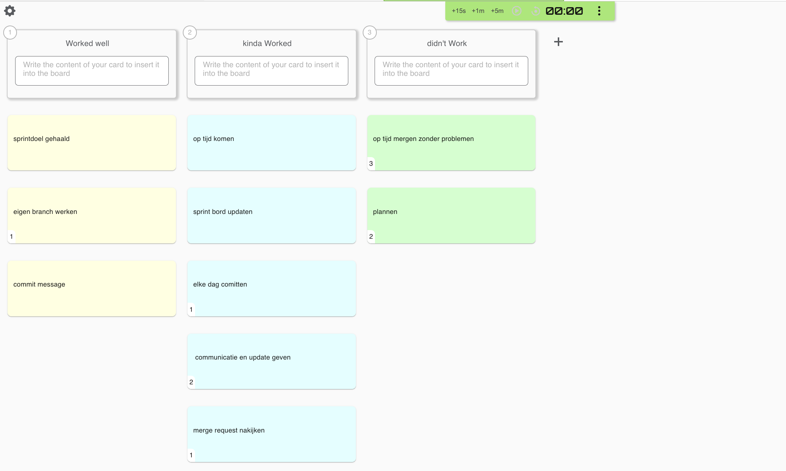

# Retrospective Sprint 3

## Uitkomst retrospective

## Aandeel teamleden

Tijdens deze sprint hebben wij als team elk persoon 2 user stories gegeven dus in totaal hebben wij als team 10 user stories. In totaal moesten wij 65 story point maken, dat is ons ook gelukt. Ons sprintdoel is ook behaald. We hebben ook alles eerlijk verdeeld, dus iedereen heeft 13 story points gehaald.

## Feedback voor teamleden

---

## Milad

**Tops:**
* Je werkt hard buiten school en biedt veel hulp aan het team, wat mij ook motiveert om ook hard te werken aan het project.(Melvin)

* Je blijft gemotiveerd en zorgt voor een goede sfeer binnen het team, waardoor samenwerken prettig is. (Sekander)

* Je leert heel hard, zowel binnen als buiten school, en je bent ook altijd bereid om anderen te helpen.(simon)

* Ik merk dat je vaak hulp biedt en hard werkt; het effect op mij is dat ik me gesteund voel.(Timi)

**Tips:**

* je kan soms wat meer rust nemen, om school stress te voorkomen.(Melvin)

* Ik zie dat je over sterke leiderschapskwaliteiten beschikt. Het zou mooi zijn als je die vaker inzet, zodat anderen daar ook van kunnen profiteren.(Timi)

* Probeer af en toe wat meer de leiding te nemen tijdens het plannen, zodat we als groep beter overzicht houden. (Sekander)

* je kan beter eerder hulp vragen, wanneer je vast loopt. (Simon)

---

## Simon

**Tops:**

* Je werkt hard aan het project op school, wat mij motiveert om ook op school hard te werken.(Melvin)

* Je werkt geconcentreerd aan je taken en levert altijd goede kwaliteit, wat het team helpt om verder te komen. (Sekander)

* Je levert goed werk op en hebt mij ook geholpen om mijn data in de database te krijgen, dit heeft mij erg geholpen en ik zou zo doorgaan.(Milad)

* ik merk dat je technische vaardigheden sterk zijn. Dat gaf mij vertrouwen in de kwaliteit van onze code en maakte samenwerken makkelijker. (Timi)

**Tips:**

* Soms maak je de user stories pas op het laatste moment af. Daardoor ervaar ik extra stress bij het mergen aan het einde van de sprint.(Timi)

* probeer meer te communiceren, zodat het team weet waaraan je werkt.(Melvin)

* Probeer soms iets meer initiatief te nemen in groepsgesprekken, zodat je ideeën nog beter naar voren komen. (Sekander)

* Ik merk dat je soms weinig communiceert en zomaar code merged zonder te bespreken, dit kan problemen opleveren, dus ik zou je adviseren om dit minder te doen. (Milad)

---

## Sekander

**Tops:**

* Je presenteert goed tijdens de sprint review, dat motiveert mij ook om beter te presenteren.(Melvin)

* Je kan goed uitleggen wat wij hebben gedaan in de sprint review. (simon)

* Je presenteert heel duidelijk en met zelfvertrouwen. Tijdens de sprint reviews gaf dat mij een goed en professioneel gevoel over ons team. (Timi)

* Je stelt actief vragen aan docenten en communiceert goed met hen, waardoor we weten wat de docenten verwachten van ons, ik zou je adviseren om zo door te gaan. (Milad)

**Tips:**

* probeer eerder te mergen om stress te voorkomen. (Melvin)

* probeer goed te plannen, niet op laatste moment om probleem op te lossen. (Simon)

* Probeer wat zelfstandiger te werken en niet te snel om hulp te vragen. Het effect op mij is dat ik soms het gevoel heb dat je te snel afhankelijk bent van anderen. (Timi)

* Ik zou je adviseren om op tijd klaar te zijn met je user stories zodat je aan het einde van de sprint niet in tijdsnood komt. (Milad)

---

## Timi

**Tops:**
* Je werkt hard en loopt voor, dat helpt mij ook hard doorwerken.(Melvin)

* Je werkt consequent aan je taken en houdt goed overzicht over wat er nog moet gebeuren. (Sekander)

* Je werkt hard en bent altijd bereid om extra werk te doen voor het team.(Simon)

* Ik zie dat je hard werkt en extra taken op je neemt, dit helpt mij ook om beter te werken en ik zou je adviseren om zo door te gaan. (Milad)

**Tips:**

* Je kan meer je mening geven zodat het hele team meer van jou kan leren en weet hoe jouw perspectief eruit ziet.(Melvin)

* Probeer iets duidelijker te communiceren wat je al hebt gedaan, zodat iedereen goed op de hoogte blijft. (Sekander)

* Ik zou het fijn vinden als je wat actiever je gedachten en voorstellen deelt met het team.(Simon)

* Ik merk dat je soms weinig communiceert waardoor we niet weten waar je mee bezig bent, ik zou je adviseren om ons vaker op de hoogte te houden. (Milad)
---

## Melvin

**Tops:**

* Ik merk dat je echt je best doet en super hard werkt, dit motiveert mij ook om ook hard te werken en ik zou je adviseren om zo door te gaan. (Milad)

* Je bent super gemotiveerd en werkt hard, wat het hele team stimuleert om ook hun best te doen. (Sekander)

* Je hebt je taken heel goed afgerond en je zorgt ook voor een positieve sfeer in het team.(simon)

* Je werkt heel hard, zowel binnen als buiten school. Het effect op mij is dat ik daardoor meer gemotiveerd ben. (Timi)

**Tips:**

* Let erop dat je niet te lang doorgaat — af en toe pauze nemen helpt om scherp te blijven. (Sekander)

* Probeer iets vaker je eigen ideeën te delen tijdens de meetings. (Simon)

* Ik zie dat je soms te lang wacht met hulp vragen, probeer dat eerder te doen. Het effect op mij is dat ik dan in korte tijd moet helpen of op een moment dat het niet altijd goed uitkomt. (Timi)

* Ik merk dat je soms te lang achter elkaar door werkt waardoor je jezelf overbelast, ik zou je adviseren om wat meer rust te nemen. (Milad)

---

##### Eigen reflectie

---

## SMART leerdoel Milad

Ik ga deze sprint werken aan een nieuwe leerdoel.

**Specifiek:**  
Ik wil mijn planningsvaardigheden verbeteren door aan het begin van elke week mijn belangrijkste taken te plannen en deze dagelijks te evalueren.

**Meetbaar:**  
Ik maak elke maandag een weekplanning in mijn notities of agenda en vink taken af zodra ze voltooid zijn. Aan het einde van de week evalueer ik kort of ik mij aan de planning heb gehouden.

**Acceptabel:**  
Dit helpt mij mijn tijd beter te verdelen en voorkomt dat ik deadlines mis.

**Realistisch:**  
Het kost slechts 10–15 minuten per week om te plannen en 5 minuten per dag om te evalueren, wat goed te combineren is met mijn andere werkzaamheden.

**Tijdsgebonden:**  
Aan het einde van deze sprint wil ik drie volledige weken hebben waarin ik mijn planning heb bijgehouden en geëvalueerd.

## Reflectie op vorige leerdoel

Bij mijn vorige leerdoel wilde ik elke dag reflecteren kort reflecteren op mezelf en mijn werk. Ik heb hier goed aan gewerkt en ik heb mijn reflecties gemaakt. Daarom sluit ik deze leerdoel af en ga ik beginnen met mijn nieuwe leerdoel.

---

## SMART leerdoel Simon

**Specifiek:** In sprint 4 wil ik consequenter communiceren met mijn team door elke werkdag kort te delen wat ik heb gedaan, wat mijn volgende stap is en waar ik eventueel hulp bij nodig heb.
**Meetbaar:** Ik geef minimaal 5 korte updates per week in de groepschat en reageer binnen 24 uur op vragen van teamleden.
**Acceptabel:** Dit verbetert de transparantie binnen het team en maakt het makkelijker om elkaar tijdig te helpen.
**Realistisch:** Aan het einde van sprint 4 bespreek ik met mijn team of mijn communicatie consistenter is geworden en of dit heeft bijgedragen aan een soepelere samenwerking.
**Tijdgebonden:** Aan het einde van sprint 3 bespreek ik met mijn team of mijn communicatie duidelijker, efficiënter en zelfverzekerder is geworden.

---

## SMART leerdoel Sekander
Na het behalen van mijn vorige doel rondom communicatie, wil ik mij nu verder ontwikkelen in het beter plannen en verdelen van mijn werk binnen het team.

### Efficiënter plannen en taken verdelen

**Specifiek:**  
Ik wil mijn werk beter plannen door aan het begin van elke sprint mijn taken duidelijk in te delen en actief af te stemmen met mijn teamleden, zodat iedereen weet wie waarmee bezig is.

**Meetbaar:**  
Ik zorg ervoor dat mijn taken aan het begin van de sprint volledig in Jira/Trello staan met duidelijke deadlines, en dat ik deze taken binnen de afgesproken tijd afrond.

**Acceptabel:**  
Dit helpt niet alleen mijzelf, maar ook het team om overzicht te houden en de voortgang beter te monitoren.

**Realistisch:**  
Ik heb toegang tot onze planningsmiddelen en overlegmomenten om dit doel te behalen.

**Tijdsgebonden:**  
Ik pas dit toe gedurende de aankomende sprint van twee weken en evalueer in de retro of mijn planning en taakverdeling effectiever zijn geworden.

---
---

## SMART-leerdoel Timi

**Specifiek:**  
Ik wil in sprint 3 mijn communicatieve bijdrage vergroten door tijdens elk teamoverleg minimaal één keer mijn mening, idee of voortgang te delen.

**Meetbaar:**  
Minstens één actieve inbreng per overleg, terug te zien in meeting.

**Acceptabel:**  
Dit helpt het team beter samenwerken en zorgt dat iedereen weet wat ik doe.

**Realistisch:**  
Ik neem al deel aan de overleggen, dus dit is goed haalbaar.

**Tijdgebonden:**  
Aan het einde van sprint 3 evalueer ik met het team of ik dit consequent heb gedaan.

---

## SMART leerdoel Melvin

**Specifiek:**  
In sprint 3 wil ik beter samenwerken door mijn sprintbord actief bij te houden. Ik zorg dat mijn taken steeds op de juiste plek staan.

**Meetbaar:**  
In minstens 8 van de 10 lessen controleer en update ik mijn sprintbord zodat het mijn actuele voortgang laat zien.

**Acceptabel:**  
Dit zorgt ervoor dat mijn team altijd weet waar ik mee bezig ben en wat ik heb afgerond.

**Realistisch:**  
Het kost maar een paar minuten per les om mijn sprintbord bij te werken.

**Tijdgebonden:**  
Dit doel geldt voor sprint 4 en wordt aan het eind van de sprint geëvalueerd.  

