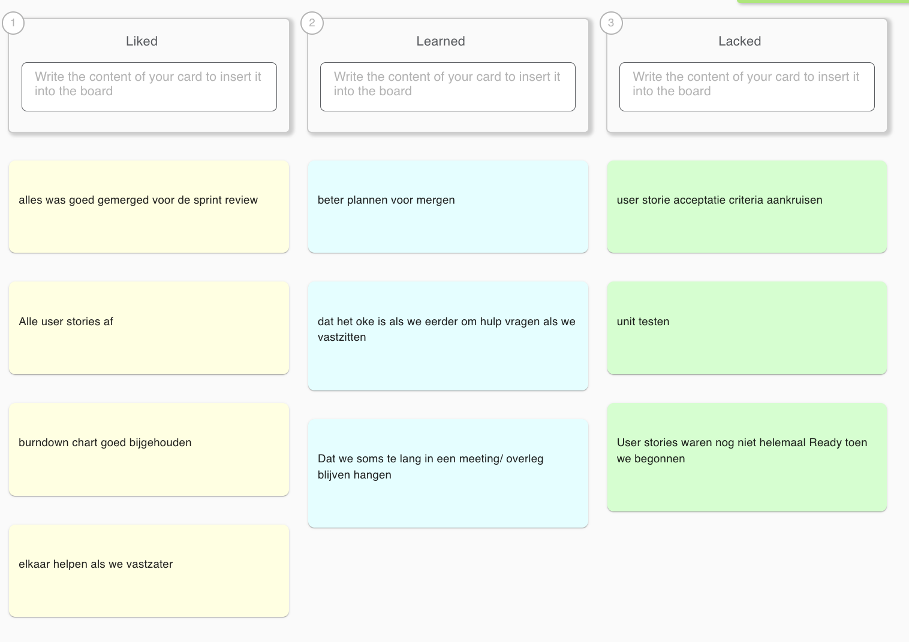

# Retrospective Sprint 4

## Uitkomst retrospective

## Aandeel teamleden

Tijdens deze sprint hebben wij als team weer hard gewerkt. Alle user stories zijn afgerond en alles was op tijd gemerged voor de review, wat een grote verbetering is ten opzichte van de vorige sprints. De burndown chart is goed bijgehouden, waardoor we niet voor verrassingen kwamen te staan.

* **Totaal behaalde story points:** 75
* **Sprintdoel:** Behaald.
* **Storypoints Verdeling:**
Milad: 19
Sekander: 11
Timi: 16
Melvin: 12
Simon: 17

## Feedback voor teamleden

---

## Milad

**Tops:**
* Je zorgt voor rust en overzicht in het team. Mede dankzij jou was de burndown chart deze sprint goed bijgehouden. (Melvin)
* Je helpt anderen nog steeds goed, maar ik merk dat je nu ook beter op je eigen planning let. (Simon)
* Je blijft de groep goed in stand houden, als er stress is, weet jij de sfeer goed te houden. (Timi)
* Fijn dat je het voortouw nam bij het bijhouden van de voortgang. (Sekander)

**Tips:**
* We moeten als team scherper zijn op de Definition of Done. Let erop dat je de acceptatiecriteria echt afvinkt voordat je een taak op 'Done' zet. (Melvin)
* Probeer bij de daily stand-up nog iets specifieker te zijn in wat je precies gaat doen. (Simon)
* Soms focussen we te veel op functionaliteit en vergeten we de unit testen; probeer hier het team aan te herinneren. (Timi)
* Je leiderschap is goed, probeer ons nog strenger te houden aan de regels van Scrum (zoals de criteria). (Sekander)

---

## Simon

**Tops:**
* **Grote verbetering:** Vorige sprint was het mergen stressvol, maar deze sprint was jouw code ruim op tijd binnen. Super fijn! (Timi)
* Je communicatie was deze sprint veel duidelijker, we wisten precies waar je mee bezig was. (Milad)
* Je technische werk is weer van hoog niveau en omdat je eerder klaar was, hadden we geen merge-conflicten. (Sekander)
* Fijn dat je de feedback van vorige keer zo goed hebt opgepakt, dat geeft veel rust. (Melvin)

**Tips:**
* Vergeet niet je unit testen te schrijven tijdens het coderen, en niet pas achteraf. (Milad)
* Let goed op de acceptatiecriteria in de tickets; soms mis ik nog een klein detail dat wel in de beschrijving stond. (Timi)
* Blijf dit communicatieniveau vasthouden, zak niet terug in stilte als het even tegenzit. (Sekander)
* Probeer tijdens de daily stand-up al aan te geven als je denkt dat testen lastig gaat worden. (Melvin)

---

## Sekander

**Tops:**
* Net als Simon heb jij deze sprint veel beter en eerder gemerged. Dat scheelde enorm veel stress voor de review. (Melvin)
* Je bent zelfstandiger geworden in het oplossen van je taken. (Timi)
* Je presentatie skills blijven een aanwinst voor het team, fijn dat je alles weer goed verwoordde. (Simon)
* Je planning was deze keer veel realistischer, waardoor je niet in tijdnood kwam. (Milad)

**Tips:**
* Let erop dat je ticket pas echt af is als ook de unit tests geschreven zijn. (Simon)
* Check bij het afronden van een story altijd even dubbel of alle vinkjes van de acceptatiecriteria groen zijn. (Milad)
* Blijf vragen stellen over de code kwaliteit, niet alleen over de functionaliteit. (Timi)
* Probeer in de volgende sprint de *Definition of Done* erbij te pakken voordat je zegt dat je klaar bent. (Melvin)

---

## Timi

**Tops:**
* Je hebt je deze sprint meer laten horen tijdens de meetings, dat vond ik erg waardevol. (Melvin)
* Je werkt hard en pakt taken snel op; fijn dat alles op tijd af was. (Sekander)
* Je bent duidelijk gegroeid in het aangeven van je status. (Simon)
* Je inzet is constant hoog, je bent een betrouwbare kracht in het team. (Milad)

**Tips:**
* Nu je meer communiceert, probeer ook inhoudelijk kritisch te zijn: zijn de unit tests wel goed genoeg? (Simon)
* Let op de details (acceptatiecriteria) bij het opleveren van je werk. (Milad)
* Durf anderen ook aan te spreken als zij hun tests of criteria vergeten. (Sekander)
* Probeer tijdens het programmeren alvast na te denken over hoe je jouw stukje code gaat testen. (Melvin)

---

## Melvin

**Tops:**
* Je hebt je perfect aan je leerdoel gehouden, het sprintbord was altijd up-to-date (Milad)
* De burndown chart zag er dankzij jouw oplettendheid goed uit. (Sekander)
* Fijn dat je weer zo hard gewerkt hebt en de sfeer positief hield. (Simon)
* Je was er vroeg bij met mergen, waardoor de review soepel verliep. (Timi)

**Tips:**
* Zorg dat je enthousiasme voor het afronden er niet voor zorgt dat je de unit tests overslaat. (Simon)
* Kijk kritisch naar de acceptatiecriteria voordat je een taak naar 'Done' sleept. (Timi)
* Blijf ook je rust pakken, zodat je scherp blijft op de kwaliteit van de code. (Milad)
* Probeer de volgende sprint beter de kwaliteit van de code te checken. (testen checken). (Sekander)

---

##### Eigen reflectie

---

## SMART leerdoel Milad 

**Specifiek:**
Ik wil in Sprint 5 zorgen voor een hogere codekwaliteit door bij elke User Story die ik afrond, minimaal een unit test te schrijven die slagen.

**Meetbaar:**
Aan het einde van de sprint heeft elke user story van mij bijbehorende werkende tests in de repository.

**Acceptabel:**
Dit is nodig omdat we merkten dat we unit testen vergaten ('Lacked' puntje).

**Realistisch:**
Unit testen horen bij het ontwikkelproces; ik plan hier tijd voor in.

**Tijdsgebonden:**
Gedurende de hele Sprint 5, geëvalueerd bij de volgende retrospective.

---

## SMART leerdoel Simon

**Specifiek:** In sprint 4 wil ik consequenter communiceren met mijn team door elke werkdag kort te delen wat ik heb gedaan, wat mijn volgende stap is en waar ik eventueel hulp bij nodig heb.
**Meetbaar:** Ik geef minimaal 5 korte updates per week in de groepschat en reageer binnen 24 uur op vragen van teamleden.
**Acceptabel:** Dit verbetert de transparantie binnen het team en maakt het makkelijker om elkaar tijdig te helpen.
**Realistisch:** Aan het einde van sprint 4 bespreek ik met mijn team of mijn communicatie consistenter is geworden en of dit heeft bijgedragen aan een soepelere samenwerking.
**Tijdgebonden:** Aan het einde van sprint 3 bespreek ik met mijn team of mijn communicatie duidelijker, efficiënter en zelfverzekerder is geworden.

---

## SMART leerdoel Sekander

**Specifiek:**
Ik wil mijn technische zelfstandigheid vergroten door te leren hoe ik goede unit tests schrijf voor mijn eigen code, zonder direct hulp te vragen.

**Meetbaar:**
Ik lever deze sprint werkende unit tests op bij mijn code en kan tijdens de code review uitleggen wat ze testen.

**Acceptabel:**
Unit testen stonden bij 'Lacked', dus dit is een belangrijk teamdoel waar ik aan bijdraag.

**Realistisch:**
Ik gebruik online bronnen of documentatie voordat ik hulp vraag aan teamgenoten.

**Tijdsgebonden:**
Aan het einde van Sprint 5.

---

## SMART leerdoel Timi

**Specifiek:**
Ik wil de kwaliteit van het teamwerk bewaken door tijdens de Daily Stand-up actief te vragen: "Hebben we hier al tests voor?" of "Zijn de criteria gecheckt?".

**Meetbaar:**
Ik stel deze kwaliteitsvraag minimaal 3 keer per week tijdens de stand-up.

**Acceptabel:**
Dit helpt het hele team om de punten van het 'Lacked' bordje op te lossen.

**Realistisch:**
Het is een kleine moeite om deze vraag te stellen, maar het heeft grote impact.

**Tijdsgebonden:**
Gedurende de twee weken van Sprint 5.

---

## SMART leerdoel Melvin

**Specifiek:**
Ik wil zorgen dat de planning realistisch blijft door tijdens de Daily Stand-up niet alleen te zeggen wat ik heb gedaan, maar specifiek te benoemen wat ik vandaag ga afronden (Beter plannen voor morgen).

**Meetbaar:**
Elke ochtend in de stand-up geef ik een concreet doel voor die dag aan.

**Acceptabel:**
Dit kwam uit de Learned kolom (beter plannen voor morgen).

**Realistisch:**
Dit vraagt enkel om een korte voorbereiding voor de stand-up.

**Tijdsgebonden:**
Elke werkdag tijdens Sprint 5.