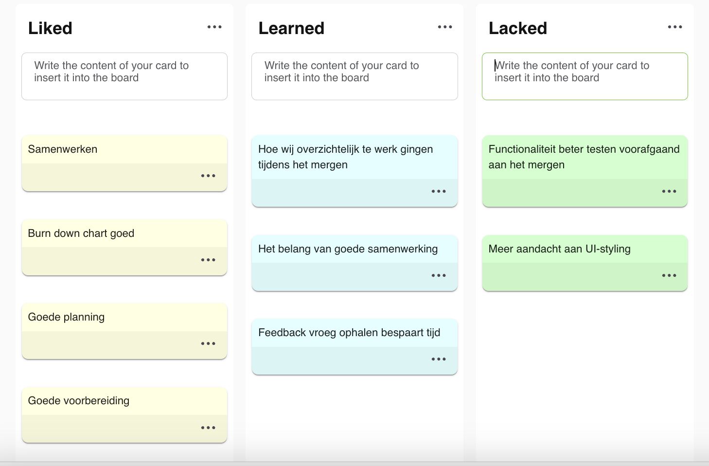

# Retrospective Sprint 4

## Uitkomst retrospective

## Aandeel teamleden

Tijdens deze sprint hebben wij als team weer hard gewerkt. Alle user stories zijn afgerond en alles was op tijd gemerged voor de review, wat een grote verbetering is ten opzichte van de vorige sprints. De burndown chart is goed bijgehouden, waardoor we niet voor verrassingen kwamen te staan.

* **Totaal behaalde story points:**  95
* **Sprintdoel:** 
* **Storypoints Verdeling:**
Milad: 29
Sekander: 13
Timi: 18
Melvin: 22
Simon: 13 (docker file, UI en online deployen niet meegetelt)

## Feedback voor teamleden

## Milad

**Tops:**
* Je bent vaak het aanspreekpunt voor het team en dat zorgt voor duidelijkheid. (Melvin)
* Je houdt goed overzicht, maar let ook beter op je eigen planning dan eerst. (Simon)
* Als er stress is, help jij mee om de sfeer rustig te houden. (Timi)
* Fijn dat je de voortgang goed in de gaten houdt en ons eraan herinnert. (Sekander)

**Tips:**
* Wees tijdens refinement iets kritischer als een ticket niet duidelijk is. (Melvin)
* Soms mag je ons wat sneller aanspreken als afspraken niet worden nagekomen. (Simon)
* Let erop dat je niet te veel taken tegelijk oppakt. (Timi)
* Blijf ons herinneren aan de Definition of Done voordat iets op ‘Done’ gaat. (Sekander)

---

## Simon

**Tops:**
* Je planning was deze sprint goed; je leverde op tijd op. (Milad)
* Je communiceerde duidelijker over waar je mee bezig was. (Timi)
* Je code was van goede kwaliteit, ook toen het wat drukker werd. (Sekander)
* Je dacht vaker mee met het team en niet alleen met je eigen taken. (Melvin)

**Tips:**
* Neem soms iets meer tijd om samen naar elkaars code te kijken. (Milad)
* Geef eerder aan als een taak lastiger blijkt dan verwacht. (Timi)
* Vergeet niet om comments en documentatie bij te werken. (Sekander)
* Blijf unit tests schrijven, ook bij kleine aanpassingen. (Melvin)

---

## Sekander

**Tops:**
* Je stemde beter af met anderen, wat mergeproblemen scheelde. (Milad)
* Je feedback tijdens reviews was duidelijker en concreter. (Simon)
* Je planning was realistischer en je gaf het op tijd aan als iets niet lukte. (Timi)
* Je presentaties waren helder en goed te volgen. (Melvin)

**Tips:**
* Vraag zelf wat vaker om een review als je klaar bent. (Milad)
* Kijk niet alleen of iets werkt, maar ook of de code netjes is. (Simon)
* Denk bij het programmeren ook aan foutgevallen. (Timi)
* Check altijd de Definition of Done voordat je een ticket afrondt. (Melvin)

---

## Timi

**Tops:**
* Je deed actiever mee aan gesprekken tijdens meetings. (Milad)
* Je pakte feedback goed op en paste dit snel toe. (Simon)
* Je kwam je afspraken na, dat was fijn voor het team. (Sekander)
* Je werkte snel, maar bleef wel zorgvuldig. (Melvin)

**Tips:**
* Leg je technische keuzes iets vaker uit aan het team. (Milad)
* Geef vaker feedback bij reviews van anderen. (Simon)
* Wees soms wat kritischer als iets net niet af is. (Sekander)
* Denk eerder na over hoe je je code gaat testen. (Melvin)

---

## Melvin

**Tops:**
* Je hield het sprintbord goed bij, dat gaf overzicht. (Milad)
* Je zorgde voor structuur tijdens meetings. (Sekander)
Fijn dat je weer zo hard gewerkt hebt en de sfeer positief hield. (Simon)
* Je dacht mee over het teamproces, niet alleen over je eigen werk. (Timi)

**Tips:**
* Blijf ook je rust pakken, zodat je scherp blijft op de kwaliteit van de code. (Milad)
* Geef het sneller aan als iets dreigt uit te lopen. (Sekander)
* Probeer feedback ook tussendoor te geven, niet alleen aan het einde. (Simon)
* Let goed op wanneer iets echt ‘Done’ is en wanneer nog niet. (Timi)

##### Eigen reflectie

## Simon
Deze sprint verliep beter dan de vorige. Mijn taken waren op tijd af, waardoor het mergen soepel ging en er geen conflicten waren. Ook was mijn communicatie duidelijker, waardoor het team goed wist waar ik mee bezig was.

Een verbeterpunt is het eerder schrijven van unit tests en beter letten op de acceptatiecriteria. In de volgende sprint wil ik dit direct tijdens het coderen meenemen en eventuele problemen eerder aangeven.

## Sekander
Aan het einde van dit project merk ik dat ik veel zelfstandiger ben geworden. Ik kon mijn taken beter plannen en oplossen zonder meteen hulp te vragen. Ook ging het mergen en afronden van mijn werk een stuk rustiger dan in eerdere sprints.

Daarnaast heb ik meer aandacht besteed aan unit tests en begrijp ik beter waarom ze belangrijk zijn. Tijdens reviews kon ik beter uitleggen wat mijn code doet en waarom ik bepaalde keuzes heb gemaakt.

Wat ik meeneem naar volgende projecten is dat ik kritisch wil blijven op de kwaliteit van mijn code en eerder feedback wil vragen, zodat ik mezelf blijf verbeteren en goed blijf samenwerken met het team.

## Melvin
Tijdens dit project heb ik vooral geleerd hoe belangrijk structuur is voor een team. Door mijn focus op het bijhouden van het sprintbord, merkte ik dat we veel minder last hadden van verrassingen en deadlines. En meer rust kregen in het team en wisten waaraan we moesten werken.

Wel heb ik geleerd dat snelheid niet altijd goed is. Zoals in de feedback aangegeven, vergat ik door mijn enthousiasme soms de unit tests of de details van de acceptatiecriteria. Ik realiseer me nu dat code pas écht Done is als de kwaliteit ook goed is, niet alleen als de functionaliteit werkt.

Dit wil meenemen naar verdere projecten in het toekomst en het ook toepassen in me dagelijks leven dat het niet altijd goed is om alles snel te doen, maar soms ook goed is om er structuur in te vinden zodat er meer rust komt en overzichtelijkheid.

## Timi
Tijdens dit project was ik actief betrokken bij de meetings en nam ik verantwoordelijkheid om het team scherp te houden op de kwaliteit van het werk. Ik durfde mijn mening te geven en mee te denken over verbeteringen, wat bijdroeg aan een beter eindresultaat.

Tegelijk merk ik dat ik soms terughoudend ben wanneer afspraken niet worden nagekomen. In toekomstige projecten wil ik hier directer in zijn, zodat verwachtingen duidelijk blijven en het team efficiënter kan samenwerken. Wat ik meeneem is dat ik actief wil blijven meedenken over kwaliteit en duidelijker wil zijn wanneer afspraken niet worden nagekomen.

## Milad
Deze sprint nam ik vaak het overzicht in het team op me. Ik hield de voortgang in de gaten, zorgde dat het sprintbord en de burndown chart werden bijgehouden en probeerde rust te bewaren binnen het team. Als er onduidelijkheid of stress was, probeerde ik te helpen door dingen te verduidelijken en het team bij elkaar te houden. Dit zorgde ervoor dat we als team beter wisten waar we stonden en wat er nog moest gebeuren.

Wat ik merkte is dat ik soms te veel tegelijk wilde doen. Hierdoor liep mijn eigen focus af en toe terug. Ook kan ik nog kritischer zijn op de Definition of Done en acceptatiecriteria voordat taken echt als “Done” worden gezien. Dit wil ik verbeteren door eerder in te grijpen en duidelijker te zijn als afspraken niet helemaal worden nagekomen.

Wat ik meeneem naar volgende projecten is dat overzicht en communicatie heel belangrijk zijn, maar dat ik ook moet letten op mijn eigen focus en kwaliteit. Door taken beter te prioriteren en het team scherper te houden op afspraken, denk ik dat ik nog effectiever kan bijdragen aan het team en het eindresultaat.
